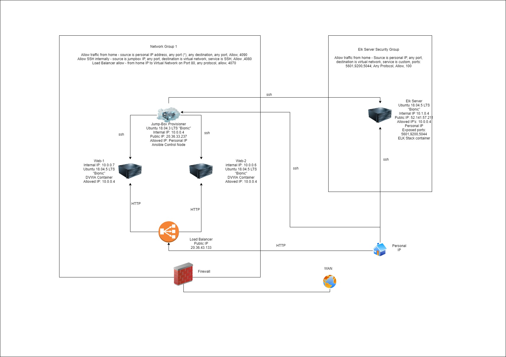
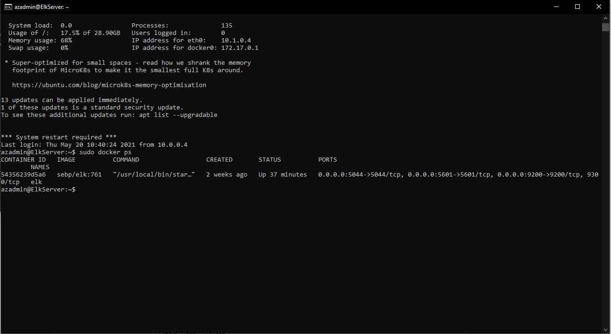

## Automated ELK Stack Deployment

The files in this repository were used to configure the network depicted below.



These files have been tested and used to generate a live ELK deployment on Azure. They can be used to either recreate the entire deployment pictured above. Alternatively, select portions of the playbook file may be used to install only certain pieces of it, such as Filebeat.

```
---
- name: Configure Elk VM with DOcker
  hosts: elk
  remote_user: azadmin
  become: true
  tasks:
     - name: Install Docker.io
       apt:
          update_cache: yes
          force_apt_get: yes
          name: docker.io
          state: present
     - name: Install Python3-pip
       apt:
         force_apt_get: yes
         name: python3-pip
         state: present
     - name: Install Docker Module
       pip:
         name: docker
         state: present
     - name: Increase virtual memory
       command: sysctl -w vm.max_map_count=262144
     - name: Use More memory
       sysctl:
         name: vm.max_map_count
         value: "262144"
         state: present
         reload: yes
     - name: download and launch a docker elk container
       docker_container:
         name: elk
         image: sebp/elk:761
         state: started
         restart_policy: always
         published_ports:
           - 5601:5601
           - 9200:9200
           - 5044:5044
```    

This document contains the following details:
- Description of the Topologu
- Access Policies
- ELK Configuration
  - Beats in Use
  - Machines Being Monitored
- How to Use the Ansible Build


### Description of the Topology

The main purpose of this network is to expose a load-balanced and monitored instance of DVWA, the D*mn Vulnerable Web Application.

Load balancing ensures that the application will be highly available, in addition to restricting access to the network.


Integrating an ELK server allows users to easily monitor the vulnerable VMs for changes to the log files and system metrics.


| Name     | Function | IP Address | Operating System |
|----------|----------|------------|------------------|
| Jump Box | Gateway  | 10.0.0.4   | Ubuntu 18.04.3   |
| Web-1    | Server   | 10.0.0.7   | Ubuntu 18.04.5   |
| Web-2    | Server   | 10.0.0.6   | Ubuntu 18.04.5   |
| ElkServer| Monitoring| 10.1.0.4  | Ubuntu 18.04.5   |


### Access Policies

The machines on the internal network are not exposed to the public Internet. 

Only the Load balancer machine can accept connections from the Internet. Access to this machine is only allowed from the following IP addresses:
Personal IP address

Machines within the network can only be accessed by the Jump-box-Provisioner with the internal ip of 10.0.0.4


A summary of the access policies in place can be found in the table below.

| Name          | Publicly Accessible | Allowed IP Addresses |
|---------------|---------------------|----------------------|
| Jump Box      | Yes                 | personal ip          |
| Load balancer | Yes                 | personal ip          |
| web server    | No                  | 10.0.0.4             |

### Elk Configuration

Ansible was used to automate configuration of the ELK machine. No configuration was performed manually, which is advantageous because it allows for a larger scale deployment ensuring environments are standardised throughout the network

The playbook implements the following tasks:
- Create a new virtual network
- Create a new VM
- Download and configure the container using Ansible playbook
- Deploy the container
- Test the contatainer is working

The following screenshot displays the result of running `docker ps` after successfully configuring the ELK instance.



### Target Machines & Beats
This ELK server is configured to monitor the following machines:
- Web-1 | 10.0.0.7
- Web-2 | 10.0.0.6

We have installed the following Beats on these machines:
Filebeat and metric beat

These Beats allow us to collect the following information from each machine:
Filebeat looks at specified logs and sends any new changes back to kibana
Metricbeat looks at system metrics and provides insight into how the CPU, Ram, IO and network traffic usually is so that spikes in any can be identified and investigated

### Using the Playbook
In order to use the playbook, you will need to have an Ansible control node already configured. Assuming you have such a control node provisioned: 

SSH into the control node and follow the steps below:
- Copy the ansible playbookfile to ```/etc/ansible```
- Update the ansible hosts file to include the IP for the VM. Specify what type of host it is by 
- Run the playbook, and navigate to the ssh to the newly set up VM and run 
``` curl localhost/setup.ph ``` to check that the installation worked as expected.
